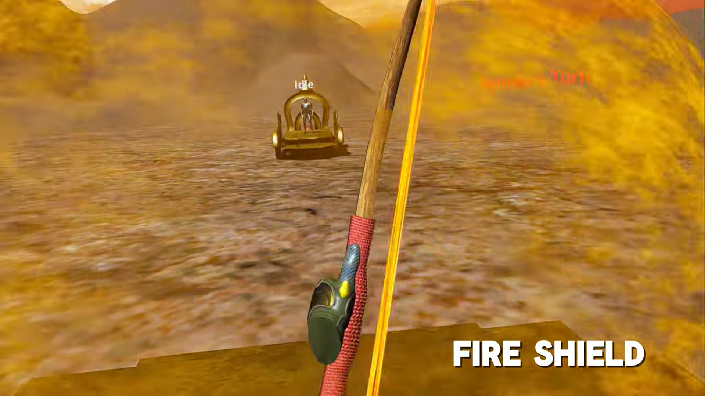
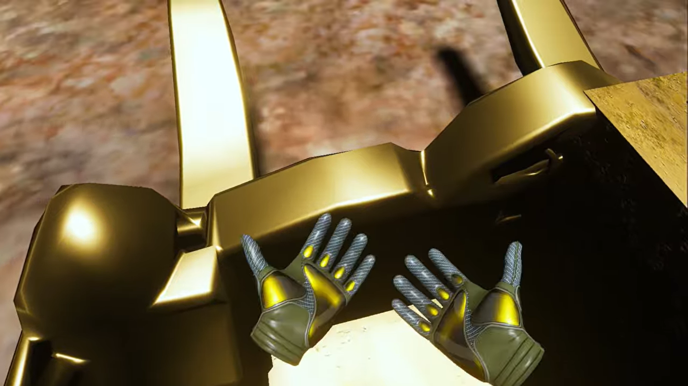
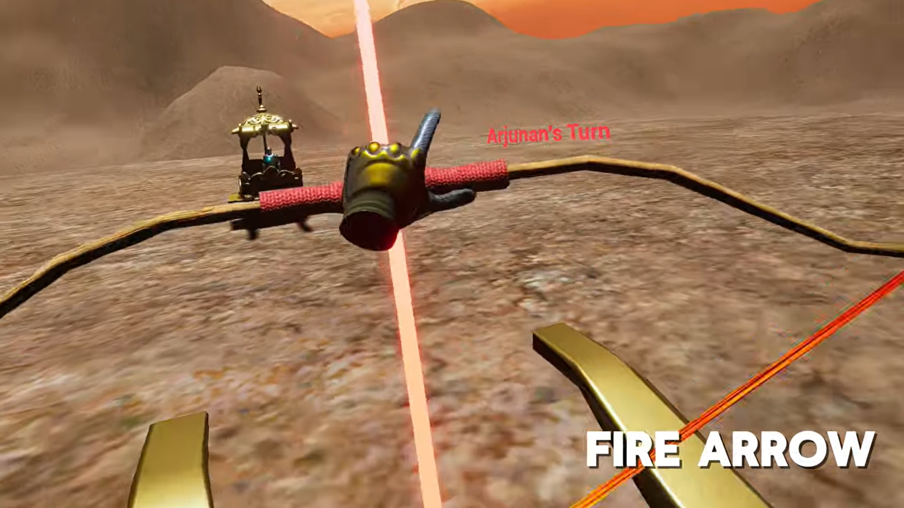
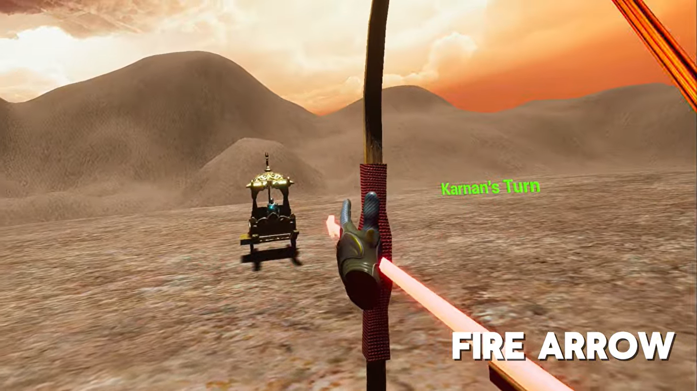
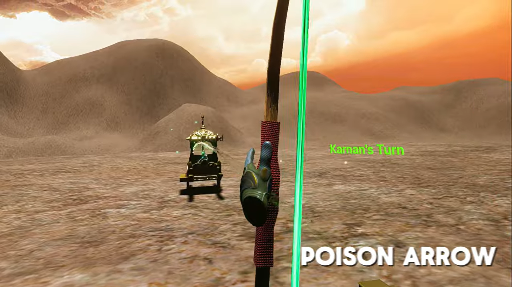

# 🏹 Mahabharatham VR

  

## 📖 Overview

Mahabharatham VR is an immersive Virtual Reality archery combat experience inspired by the epic Mahabharata. Players engage in realistic bow-and-arrow mechanics within a cinematic environment built in Unreal Engine 5.

---

## ✨ Features

- 🏹 VR Bow & Arrow System
- 🎯 Physics-based Shooting
- 🎮 Motion Controller Support
- 🌍 Immersive Environment
- 💡 Real-time Lighting
- 🔵 Blueprint Gameplay Logic

---

## 🛠 Tech Stack

- Unreal Engine 5
- Blueprints
- VR Template
- Lumen
- Quixel Megascans

---

## 🎥 Demo Video

https://youtu.be/3XmUOb1eJl8

---

## 📸 Gallery

---

## 👨‍💻 My Contribution

- Designed the gameplay
- Implemented VR interaction using Blueprints
- Built the environment
- Configured lighting
- Created cinematic sequences
- Optimized the VR experience

---

## 🚀 Future Improvements

- Better enemy AI
- Improved archery mechanics
- Expanded combat scenarios
- Enhanced visual effects

---

⭐ If you enjoyed this project, don't forget to star the repository!
